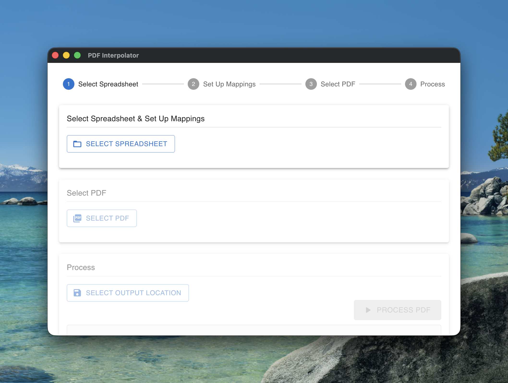
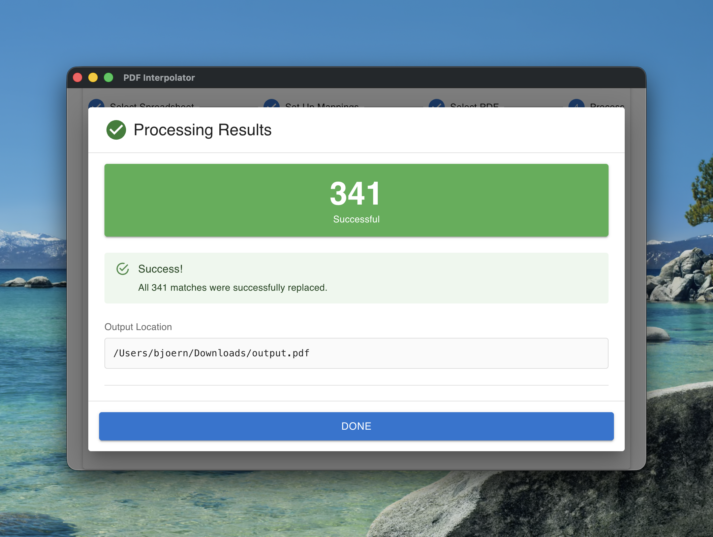

# PDF Interpolator

A desktop application for replacing text in PDF files using data from spreadsheets.


## Overview

PDF Interpolator reads a spreadsheet (Excel or CSV) and replaces matching text in a PDF document. You define which columns to use: one column contains the text to find, another contains the replacement text.

The application preserves the original PDF formatting, fonts, and layout while performing the replacements.

|||
|-|-|
|||

## Download

Download the latest version for your operating system from the [releases page](https://github.com/itsbjoern/pdf-interpolator/releases).

**Available for:**
- Windows (.exe installer)
- macOS (DMG)
- Linux (AppImage, snap, deb)

## How to Use

### 1. Select a Spreadsheet

Click "Select Spreadsheet" and choose your Excel or CSV file. If your spreadsheet has multiple sheets, select which ones you want to use.

### 2. Set Up Column Mappings

For each sheet, specify two columns:
- **Source Column**: Contains the text to search for in the PDF
- **Target Column**: Contains the replacement text

Example: If your spreadsheet has "Old Name" and "New Name" columns, the app will find each "Old Name" value in the PDF and replace it with the corresponding "New Name" value.

### 3. Select the PDF

Choose the PDF file you want to process.

### 4. Choose Output Location

Select where to save the modified PDF.

### 5. Process

Click "Process PDF" to start. The application will show a detailed results window with:
- Total matches found
- Successful replacements
- Any encoding issues (if characters in your replacement text are not available in the PDF's fonts)

## Requirements

- The spreadsheet must contain at least two columns per sheet (one for finding text, one for replacing)
- Text matches are case-sensitive
- Empty cells are skipped

## Known Limitations

- Special characters in replacement text must be available in the PDF's fonts
- Very large PDFs may take longer to process
- Text spanning multiple lines or text segments may not be replaced

## Building from Source

```bash
# Install dependencies
npm install

# Run in development mode
npm run dev

# Build for production
npm run build

# Build platform-specific installers
npm run build:win    # Windows
npm run build:mac    # macOS
npm run build:linux  # Linux
```
